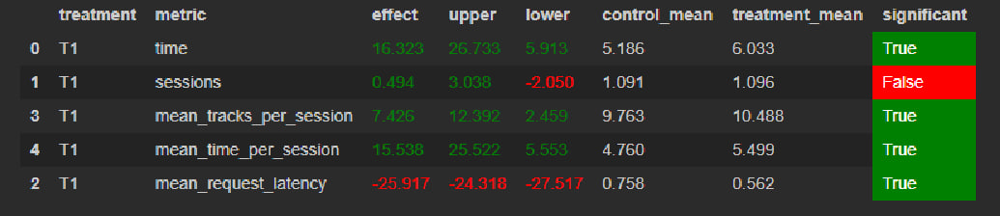

# Домашнее задание Шабуров Евгений
## Идея
Все очень просто. Возьмем за основу нейросетевой рекомендер, но будем давать иногда треки из TopPop.

## Детали
Для начала я решил пошаманить с параметрами нейросетевого рекомердера, однако статистически значимого результата я добиться не смог. Позже я попробовал заменить рандомный рекомендер (который мы подсовываем при неимении рекомендаций) на TopPop рекомендер. Далее из этого я решил давать TopPop рекомендации не только когда, у меня нет рекомендаций, но и когда предыдущая рекомендация оказалась очень плохой (длительность прослушивания менее 0.3).  

Способ запуска изменений не претерпел. Дополнительных данных скачивать не требуется.

